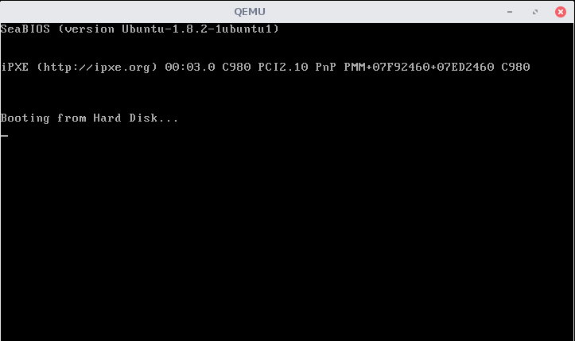

## Booting

The BIOS (Basic Input Output System) software is the code that is
first run when the computer is turned on. It performs a power-on
self-test (POST) - identifying hardware devices such as the CPU, mouse
etc.
 
The OS is a file located on a storage device (such as a hard disk)
booted by the BIOS on starting a computer. In order to do this, the
BIOS searches the first sector, known as the /boot sector/, usually
512 bytes. To ensure that the file is an operating system and not
data, the boot sector looks at the last two bytes of the sector. If
the last two bytes is the number *0xaa55*, it is an indicator that the
file is an OS. 

When a boot sector is found, it is loaded into the RAM at memory address
**0x0000:0x7c00**.

### Example code of a boot sector 

Given is a simple example of code (hex encoding) for a boot sector:

```
e9 fd ff 00 00 00 00 00 00 00 00 00 00 00 00 00
00 00 00 00 00 00 00 00 00 00 00 00 00 00 00 00
[ 29 lines of 16 bytes of zeroes each (making 512 bytes in total) ]
00 00 00 00 00 00 00 00 00 00 00 00 00 00 55 aa
```

Note how the last two bytes make up the signature of the boot sector
that indicates it's an OS. Be careful - the x86 instruction set
architecture follows [little endian](https://stackoverflow.com/questions/5185551/why-is-x86-little-endian).

The first three bytes **e9 fd ff** indicates an infinite loop - a jump
that jumps to itself. **e9** is opcode for =jmp= instruction. The number
**0xfffd** is -3 in decimal (signed 2's complement) and is the
offset. Since jump offsets start from the address of the next
instruction onwards, 3 bytes are jumped back again to the **e9** long
jump instruction.

### Running the code 

The code above has been saved in [boot_sector.bin](https://github.com/SanjanaSunil/OS/blob/master/booting/boot_sector.bin).  You can
write your own using a binary editor.

A CPU emulator that behaves like a specific architecture such as
Bochs, Qemu etc. can be used to test programs.

Install Qemu and run the program using ```qemu boot_sector.bin```. If that
command doesn't work, try ```qemu-system-x86_64 boot_sector.bin``` (for
64-bit systems) or ```qemu-system-i386 boot_sector.bin``` (for 32-bit
systems).



The above window pops up. Nothing happens further because the system
is in an infinite loop. 

*What happens if you change the last two bytes of the boot sector to
something else?*

### Coding with assembly language

Using machine language can be tedious. The same code can be written
in assembly language to make things easier.

1. Create a [boot_sector.asm](./boot_sector.asm) file with the following assembly code in it:

   ```
   loop:                     ; Define a 'loop' label 
       jmp loop              

   times 510-($-$$) db 0     ; Continue filling with zeroes (db 0) until the 510th byte   

   dw 0xaa55                 ; Remaining 2 bytes is 0xaa55 indicating it is a boot sector to BIOS
   ```

2. Install [NASM](https://www.nasm.us/).
 
3. Compile boot_sector.asm to machine language using the command ```nasm
   boot_sector.asm -f bin -o new_boot_sector.bin```.

4. Run the code using ```qemu new_boot_sector.bin``` or
   ```qemu-system-x86_64 new_boot_sector.bin```.

```new_boot_sector.bin``` has the machine language code translated from
assembly using NASM. *Compare new_boot_sector.bin and
boot_sector.bin. Do you see any differences?*

### Viewing the master boot record in your system

Try running the command given below on the terminal to view the boot
sector in Linux. 

```
sudo dd if=/dev/sda bs=512 count=1 | hexdump -C
```

Note the last two bytes of the output of the code! 

To view the master boot record on Windows or other operating systems,
refer [this link](https://www.techwalla.com/articles/how-to-view-the-contents-of-a-master-boot-record) or [here](https://stackoverflow.com/questions/21647752/how-to-read-the-mbr-master-boot-record-in-c).


 

